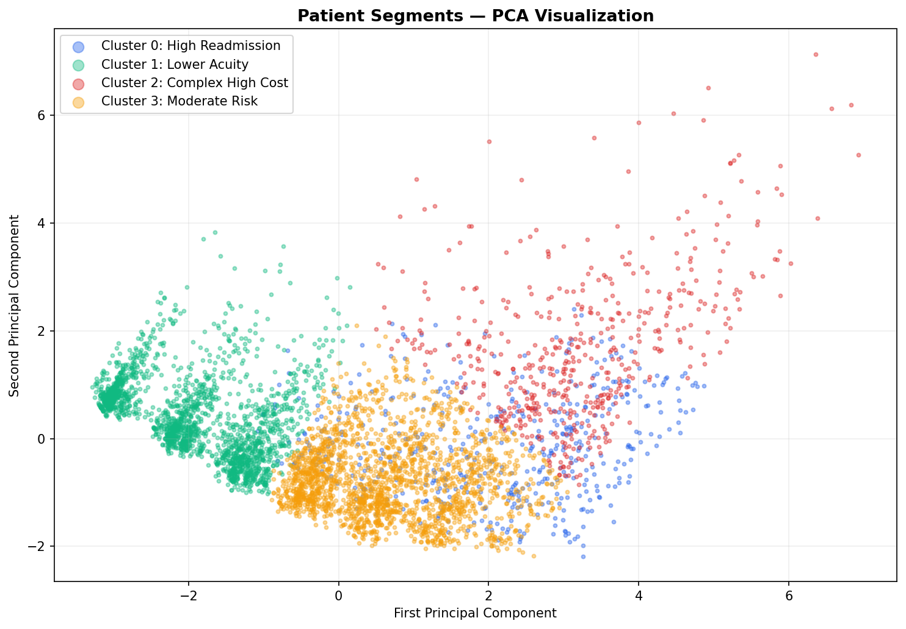

# Medicare Patient Risk Analysis
## Can we predict which Medicare patients will be readmitted?

**Author:** Jeffrey Lee  
**Data:** CMS 2008-2010 DE-SynPUF, Beneficiary and Inpatient Claims, Samples 1-5  
**Notebook:** [notebooks/medicare_readmission_analysis.ipynb](notebooks/medicare_readmission_analysis.ipynb)

---

## Why I built this

I spent a few years working in Medicare finance at Kaiser Permanente and 
kept running into the same two questions: which members are going to end 
up back in the hospital, and which ones are going to be really expensive? 
Health plans spend a lot of time trying to answer those questions because 
the answers determine where care management resources go.

When I started learning data science I wanted to actually try to answer 
them with machine learning instead of just spreadsheets. This project is 
that attempt. It is not a production model and the data is synthetic, but 
it was genuinely interesting to see how well simple features like age and 
chronic conditions could predict something as complex as hospital 
readmission.

---

## The data

CMS publishes a fake Medicare dataset called DE-SynPUF that is designed 
to look like real claims data without exposing any actual patient 
information. I used five of the twenty available samples, which gave me 
581,780 patients and 332,606 hospital admissions to work with. After 
filtering to patients who were hospitalized at least once the final 
dataset has 188,559 patients.

| File | What it contains |
|---|---|
| Beneficiary Samples 1-5 | Demographics and chronic conditions |
| Inpatient Claims Samples 1-5 | Hospital admissions and costs |

---

## Project Structure

    medicare-readmission-analysis/
    ├── data/
    │   ├── raw/              ← Downloaded CMS zip files (not in GitHub)
    │   └── processed/        ← analysis_dataset.csv (not in GitHub)
    ├── docs/
    │   └── charts/           ← Charts generated by the notebook
    ├── notebooks/
    │   └── medicare_readmission_analysis.ipynb  ← Main analysis
    ├── src/
    │   ├── ingest.py         ← Downloads and unzips the CMS files
    │   └── prepare.py        ← Cleans and builds the analysis dataset
    ├── .gitignore
    ├── README.md
    └── requirements.txt

---

## How to run it

**1. Clone the repo**

    git clone https://github.com/jeffreyjblee/medicare-readmission-analysis.git
    cd medicare-readmission-analysis

**2. Set up a virtual environment**

    python -m venv .venv

    # Windows
    .venv\Scripts\activate

    # Mac/Linux
    source .venv/bin/activate

**3. Install dependencies**

    pip install -r requirements.txt

**4. Download and prepare the data**

    python src/ingest.py      # downloads roughly 500MB of CMS zip files
    python src/prepare.py     # builds the analysis dataset

**5. Open the notebook**

    jupyter notebook notebooks/medicare_readmission_analysis.ipynb

---

## What I found

The most surprising thing was how clean the relationship between chronic 
conditions and readmission turned out to be. Patients with no chronic 
conditions have an 11.5% readmission rate. Patients with 11 conditions 
have a 94% readmission rate. And it climbs almost perfectly linearly in 
between. I was not expecting it to be that consistent across 188,000 
patients.

The other interesting finding was that not all conditions are equal. 
Kidney disease and COPD turned out to be stronger individual predictors 
of readmission than diabetes or ischemic heart disease, even though those 
two are way more common. That seems important for how health plans 
prioritize outreach.

Predicting cost was a lot harder than predicting readmission. The same 
features that worked well for readmission basically failed at predicting 
how expensive a patient would be. I think that is because cost depends a 
lot on how many times someone was admitted, which I had to leave out of 
the model to avoid data leakage.

The clustering section was probably the most fun. The algorithm found four 
pretty distinct patient groups on its own, including one group of about 
18,000 patients where every single patient was readmitted and average 
cost was over 53,000 dollars. That group is only 10% of the dataset but 
would represent an enormous share of total spend.

---

## Model results

| Model | Task | ROC-AUC |
|---|---|---|
| Logistic Regression | Readmission prediction | 0.763 |
| Random Forest | Readmission prediction | 0.698 |
| Logistic Regression | High-cost classification | 0.699 |
| Random Forest | High-cost classification | 0.632 |

One thing that tripped me up early on: an initial version of the model 
included inpatient visit count as a feature and got a perfect ROC-AUC of 
1.0. Took me a minute to realize that readmission is literally defined as 
having more than one visit, so the model was just reading the answer 
directly from the input. Removing that feature brought the scores down to 
something realistic.

---

## Tools used

pandas, numpy, scikit-learn, matplotlib, seaborn, Jupyter, Python 3

---

## Limitations

The data is synthetic and CMS says not to use it for real research 
conclusions. The readmission definition I used is also simplified since 
real readmission measures typically require a specific time window between 
discharge and return that I did not apply here.

> Race and ethnicity categories follow CMS standard coding from the 
> original SynPUF data.